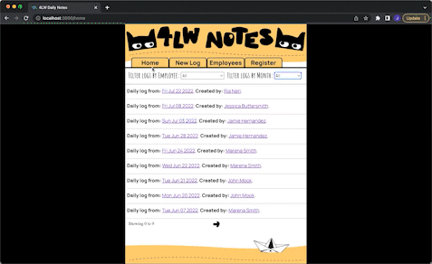
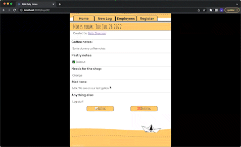

### **Project Goal:** 
An application where employees could create and log notes of day to day activities at a coffee shop.  

**Features:**

Allows a use to create a new log using the form as well as creating a new employee . The log is submitted with the date created. The logs are displayed most recent to oldest on the home page. An employee or user can filter logs by month or employee. Each log has its dedicated page as does an employee which displays their own logs. Users can update or delete a log or employee info from this dedicated page.

**Walkthrough:**

The home screen displays all the submitted logs by date and who they were created by. It features two filters for users to narrow down the logs, filter by month and filter by employee. The navbar features "Create Log" for creating a new log, an "Employees" tab for seeing <ins>all</ins> the employees's info, and a "Register" tab that allows the user to create a new employee.

Each created log or employee has their own window. This specific window allows all the infomation to be patched or updated as needed. The user also has the ability to delete the specific log or employee. Deleting an employee will also delete the logs that employee has created.

Technologies Used:
* React
* Ruby
* Active Record
* Sinatra

